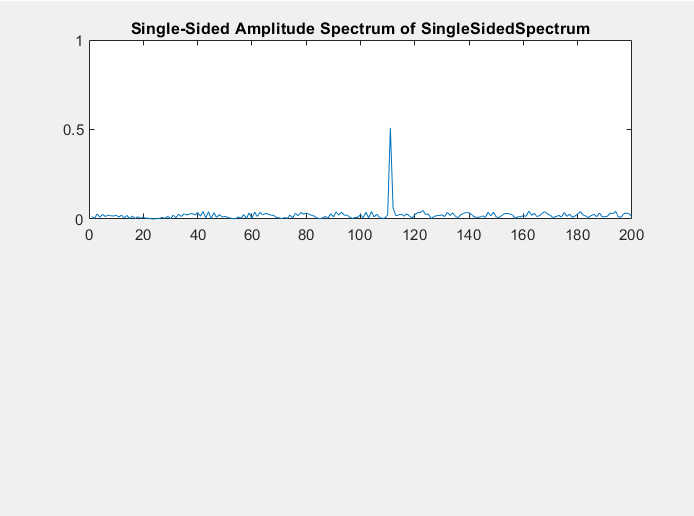
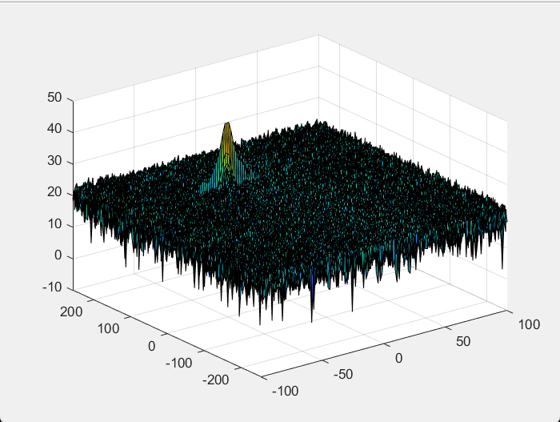
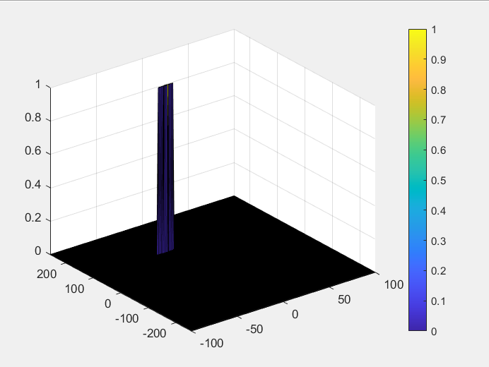
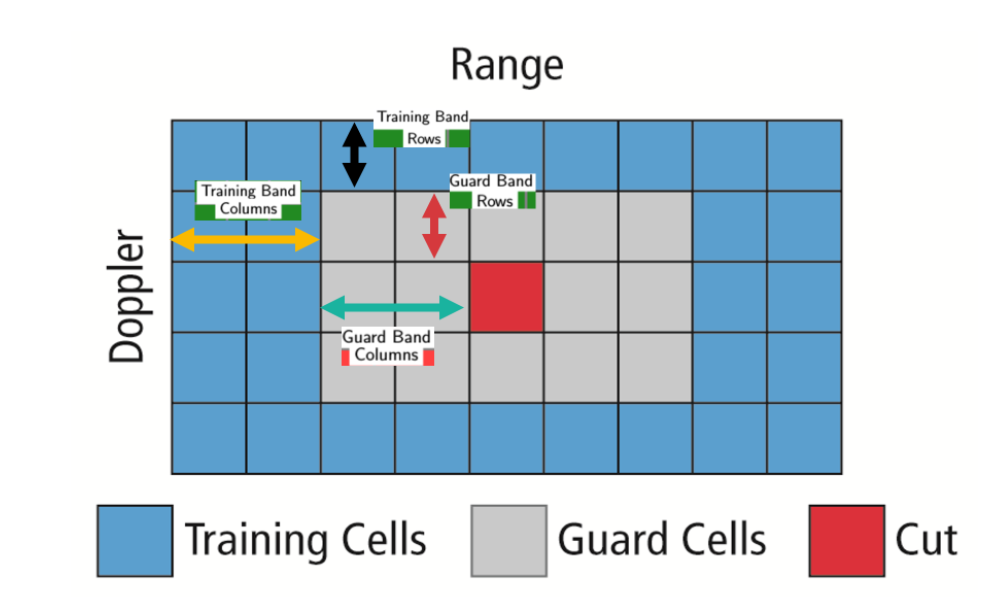

## Author : Shantam Bajpai
# Radar_Target_Tracking

## Description
This is the final project of the RADAR course , which is part of the sensor fusion nanodegree offered by Udacity. The layout of the project was as follows.

Given the RADAR parameters we had to configure the FMCW (Frequency modulated continuous waveform) waveform based on the system parameters. After the completetion of this step compute the beat signal which is nothing but the mixing of the Recieved and the transmit signal. On this beat signal compute the Fast Fourier Transform across the range dimension and compute the single sided spectrum that will give a peak at a certain range based on our initial setting of the vehicle range. After Range FFT computation I performed the 2D CFAR (Constant False Alarm Rate) for noise thresholding of the output 2D FFT which gave me the target response with the (X,Y,Z) axes denoting the range velocity and signal strength.

## Output for 1DFFT, 2DFFT(Range Doppler Map) and Target Detection

## 2D CFAR (Constant False Alarm Rate)

One of the most common detection techniques is the CA-CFAR (Cell Averaging). Now the FFT blocks are generated by implementing the range and doppler FFT's across the number of chirps. CFAR is very much like convolution as its a sliding window approach to eliminate noise and keeep the output target response. In CFAR we have 3 components described as follows.

**Cell under Test**: It is the cell that is tested to detect the presence of a target by comparing signal level to noise ratio (SNR)

**Training Cells**: The level of noise is measured over the training cells. This noise is estimated by averaging the noise under the training cells. The number of training cells should be decided based on the environment. Lets say if we have a dense traffic scenario, fewer training cells should be used as the targets are closely space

**Guard Cells**: The cells which are next to the cell under test are called the guard cells. The purpose of these cells is to avoid the signal leaking into the training cells which would adversely affect the noise estimates by the training cells.

Below is an illustration of the idea and the algorithm to follow while implementing the same

1.	Determine number of training cells for each dimension Tr and Td. Similarly pickup the number of guard cells Gr and Gd.
2.	Slide the Cell Under Test (CUT) across the complete cell matrix.
3.	Select the grid that includes the training, guard and test cells. Grid Size = (2Tr + 2Gr + 1)(2Td + 2Gd + 1)
4.	The total number of cells in the guard region and cell under test. (2Gr+1)(2Gd+1).
5.	This gives the Training Cells : (2Tr+2Gr+1)(2Td+2Gd+1) - (2Gr+1)(2Gd+1)
6.	Measure and average the noise across all the training cells. This gives the threshold
7.	Add the offset (if in signal strength in dB) to the threshold to keep the false alarm to the minimum.
8.	Determine the signal level at the Cell Under Test.
9.	If the CUT signal level is greater than the Threshold, assign a value of 1, else equate it to zero.
10.	Since the cell under test are not located at the edges, due to the training cells occupying the edges, we suppress the edges to zero. Any cell value that is neither 1 nor a 0, assign it a zero.

The parameters I used were 
Training cells In range dimension(Tr) = 12 
Training cells In doppler dimension(Td) = 6 
Guard Cells in Range dimensions(Gr) = 4
Guard Cells in Doppler dimensions(Gd) = 3
offset = 1.2

